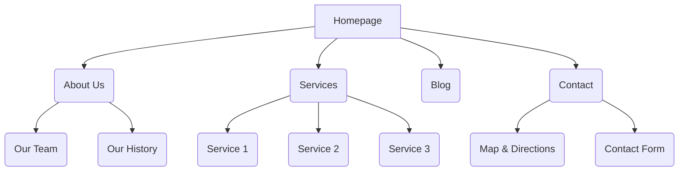

# lab1029

```mermaid 
graph TD
    A[Homepage] --> B(About Us)
    A --> C(Services)
    A --> D(Blog)
    A --> E(Contact)

    B --> B1(Our Team)
    B --> B2(Our History)

    C --> C1(Service 1)
    C --> C2(Service 2)
    C --> C3(Service 3)

    E --> E1(Map & Directions)
    E --> E2(Contact Form)
```
