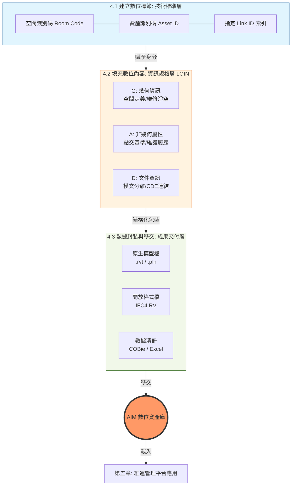

# lab1029

```mermaid 

graph TD
    subgraph S1 [4.1 建立數位標籤: 技術標準層]
        A1[空間識別碼 Room Code] --- A2[資產識別碼 Asset ID]
        A2 --- A3[指定 Link ID 索引]
    end

    subgraph S2 [4.2 填充數位內容: 資訊規格層 LOIN]
        B1[G: 幾何資訊<br/>空間定義/維修淨空] 
        B2[A: 非幾何屬性<br/>點交基準/維護履歷]
        B3[D: 文件資訊<br/>模文分離/CDE連結]
    end

    subgraph S3 [4.3 數據封裝與移交: 成果交付層]
        C1[原生模型檔<br/>.rvt / .pln]
        C2[開放格式檔<br/>IFC4 RV]
        C3[數據清冊<br/>COBie / Excel]
    end

    S1 -->|賦予身分| S2
    S2 -->|結構化包裝| S3
    S3 -->|移交| AIM((AIM 數位資產庫))
    AIM -->|載入| FM[第五章: 維運管理平台應用]

    style AIM fill:#f96,stroke:#333,stroke-width:4px
    style S1 fill:#e1f5fe,stroke:#01579b
    style S2 fill:#fff3e0,stroke:#e65100
    style S3 fill:#f1f8e9,stroke:#33691e
```
