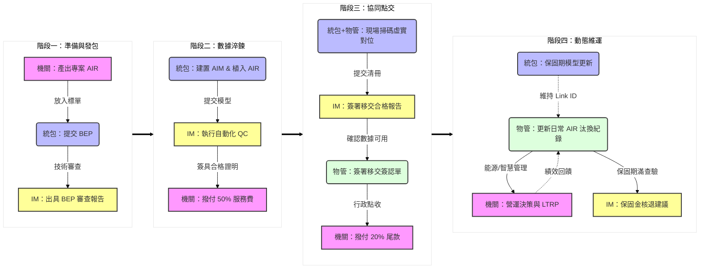

# lab1029

```mermaid 

%%{init: {'theme': 'base', 'themeVariables': { 'primaryColor': '#e1f5fe', 'edgeLabelBackground':'#ffffff', 'tertiaryColor': '#fff'}}}%%
graph LR
    %% 定義階段 (橫軸)
    subgraph Phase1 [階段一：準備與發包]
        direction TB
        A1[機關：產出專案 AIR] -->|放入標單| B1(統包：提交 BEP)
        B1 -->|技術審查| C1[IM：出具 BEP 審查報告]
    end

    subgraph Phase2 [階段二：數據淬鍊]
        direction TB
        B2(統包：建置 AIM & 植入 AIR) -->|提交模型| C2[IM：執行自動化 QC]
        C2 -->|簽具合格證明| A2[機關：撥付 50% 服務費]
    end

    subgraph Phase3 [階段三：協同點交]
        direction TB
        B3(統包+物管：現場掃碼虛實對位) -->|提交清冊| C3[IM：簽署移交合格報告]
        C3 -->|確認數據可用| D3(物管：簽署移交簽認單)
        D3 -->|行政點收| A3[機關：撥付 20% 尾款]
    end

    subgraph Phase4 [階段四：動態維運]
        direction TB
        D4(物管：更新日常 AIR 汰換紀錄) -->|能源/智慧管理| A4[機關：營運決策與 LTRP]
        A4 -.->|績效回饋| D4
        B4(統包：保固期模型更新) -.->|維持 Link ID| D4
        D4 -->|保固期滿查驗| C4[IM：保固金核退建議]
    end

    %% 連接階段
    Phase1 ==> Phase2 ==> Phase3 ==> Phase4

    %% 樣式定義
    classDef owner fill:#f9f,stroke:#333,stroke-width:2px;
    classDef im fill:#ff9,stroke:#333,stroke-width:2px;
    classDef contractor fill:#bbf,stroke:#333,stroke-width:2px;
    classDef fm fill:#dfd,stroke:#333,stroke-width:2px;

    class A1,A2,A3,A4 owner;
    class C1,C2,C3,C4 im;
    class B1,B2,B3,B4 contractor;
    class D3,D4 fm;


```
